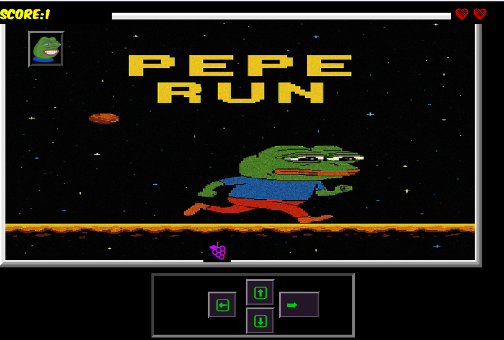

# 🕹️ Pepe Run

**Pepe Run** is a retro-style 2D arcade game made with **Tkinter** and **Pygame Mixer**, where you control a cute Pepe and collect falling items while avoiding misses. Earn points, listen to background music, and survive as long as you can!



---

## 🎮 Features

- Emoji-based collectibles falling from the top
- Control Pepe using arrow keys or on-screen buttons
- Score and life counter
- Game Over popup with restart functionality
- Smooth background music and SFX
- Fully GUI-based with Tkinter

---

## 🔧 Requirements

- Python 3.7+
- `pygame`
- `Pillow` (for image handling)

You can install them easily using:

```bash
pip install -r requirements.txt
