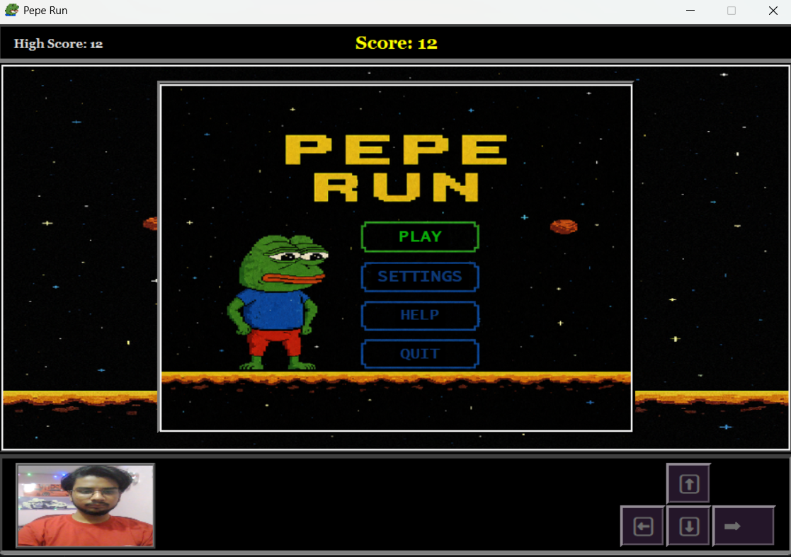
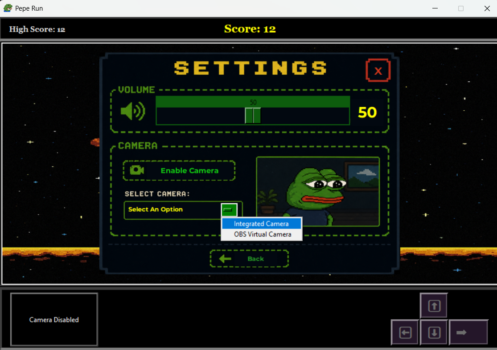
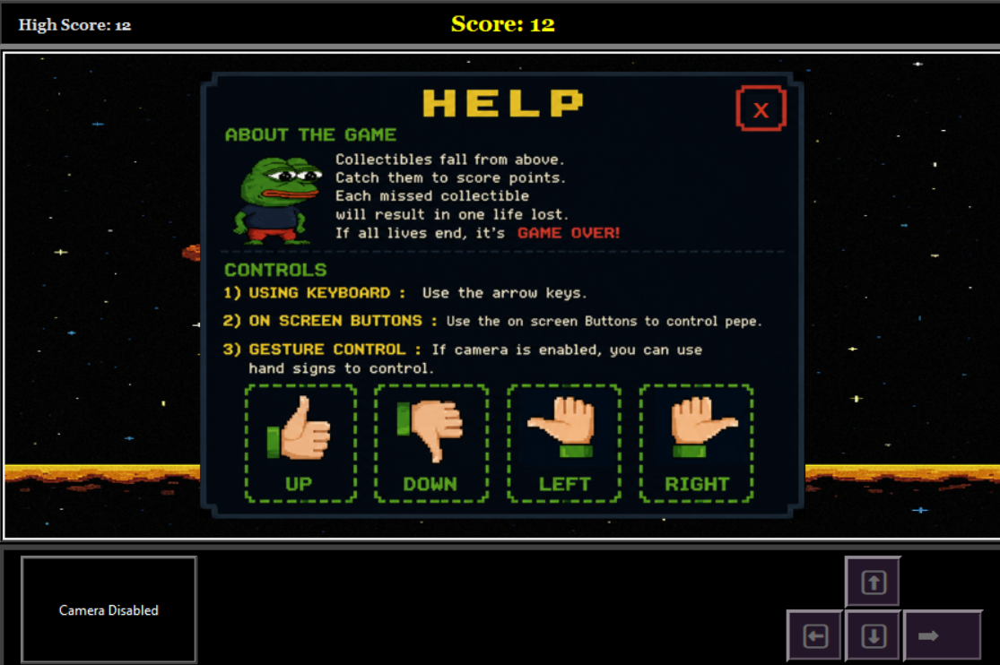
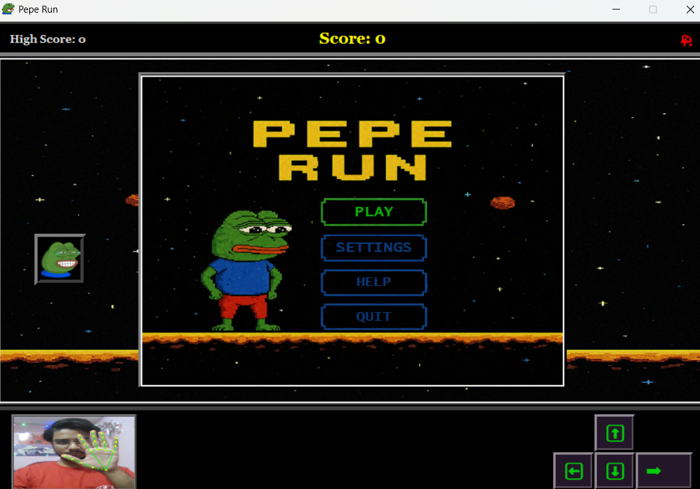

# Pepe Run

> **A touch-free 2D game powered by Computer Vision and Machine Learning.**
> Built with Python, Tkinter, OpenCV, MediaPipe Tasks, and PyTorch.

> **Engineering Focus:** Event-driven software architecture • Computer Vision • Machine Learning • Real-time systems • Modular application design


---


## Overview

Pepe Run is a desktop game that can be played **entirely without touching the keyboard**. Instead of traditional controls, the player can control the character using real-time hand gestures detected through a webcam.

While the gameplay itself is intentionally simple, the project was built as an engineering exercise to explore how multiple technologies can be integrated into a cohesive real-time application. It combines GUI programming, computer vision, machine learning, audio management, persistent storage, and modular software architecture into a single project.

The project slowly evolved into a complete application with a custom-trained gesture recognition pipeline, multiple input methods, and a modular codebase designed for maintainability and future expansion.

---


# Features

* Real-time gesture-controlled gameplay
* Keyboard and on-screen button controls
* Camera preview with gesture visualization
* Main menu and navigation system
* Settings menu

  * Volume control
  * Camera enable/disable
  * Camera device selection
* Persistent high score system
* Dynamic difficulty scaling
* Background music and sound effects
* Help screen
* Game Over screen with restart and menu navigation

---

# Gameplay

The player begins at the main menu where they can:

* Start a new game
* Read gameplay instructions
* Configure audio and camera settings
* Select the active camera device
* Quit the application

During gameplay:

* Collectibles fall from the top of the screen one at a time.
* The player controls **Pepe** using:

  * Arrow keys
  * On-screen buttons
  * Hand gestures captured through the webcam
* Successfully catching a collectible:

  * Increases the score
  * Increases the falling speed of future collectibles
* Missing three collectibles ends the game.
* The Game Over screen displays the final score and allows the player to restart, return to the main menu, or quit.

---

# Gesture Recognition Pipeline

One aspect of this project that I am particularly proud of is that the entire machine learning pipeline was built independently.

The workflow consists of:

1. Recording custom gesture videos.
2. Automatically extracting frames.
3. Running MediaPipe Hands to generate 3D hand landmarks.
4. Creating labelled datasets for each gesture.
5. Training a lightweight PyTorch classifier.
6. Integrating the trained model directly into the game.

During gameplay the pipeline operates as follows:

```
Webcam
    ↓
OpenCV
    ↓
MediaPipe Hands
    ↓
Hand Landmark Extraction
    ↓
PyTorch Gesture Classifier
    ↓
Predicted Gesture
    ↓
Game Input
```

Supported gestures:

* 👍 Thumbs Up
* 👎 Thumbs Down
* 👈 Thumbs Left
* 👉 Thumbs Right
* Neutral / No Gesture

This landmark-based approach replaced an earlier YOLO-based implementation and proved to be significantly more lightweight and robust across different users and environments.

---

# Project Structure

```
pepe-run/
│
├── game.py                 # Main game controller
│
├── components/
│   ├── camera.py
│   ├── collectibles.py
│   ├── pepe.py
│   ├── saveManager.py
│   ├── sound.py
│   └── ui.py
│
├── vision_model/
│   ├── gesture.py
│   ├── hand_landmarker.task
│   └── ver1/
│
├── assets/
│   ├── sounds/
│   └── ...
│
└── data/
    └── saves.json
```

The project is intentionally organized into independent modules responsible for distinct areas of the application:

* **Game** — Coordinates gameplay and application state.
* **UI** — Handles all graphical interface elements.
* **Camera** — Captures frames and communicates with the vision pipeline.
* **Vision Model** — Performs gesture recognition.
* **Sound** — Manages music and sound effects.
* **Save Manager** — Stores persistent high scores.

This separation makes the project considerably easier to extend and maintain than the original monolithic implementation.

---

# Technologies Used

* Python
* Tkinter
* OpenCV
* MediaPipe Tasks
* PyTorch
* pandas
* scikit-learn
* pygame-ce

---

# Engineering Highlights

This project demonstrates:

* Modular software architecture
* Event-driven programming with Tkinter
* Integration of multiple independent subsystems
* Custom machine learning pipeline development
* Real-time computer vision
* Model training and deployment
* Data collection and preprocessing
* Iterative software refactoring
* Practical problem solving through experimentation and redesign

---

# Future Improvements

Some ideas for future development include:

* Improved character animations
* Additional gesture commands
* Multiple game modes and levels
* Better packaging and cross-platform distribution
* Pause menu
* Additional collectibles and obstacles
* Improved visual effects

---

# Installation

Clone the repository:

```bash
git clone https://www.github.com/ayaan0604/pepe-run.git
cd pepe-run
```

Install the required packages:

```bash
pip install -r requirements.txt
```

Run the game:

```bash
python game.py
```

---

# Media

## Gameplay


## Screenshots










---

# Motivation

This project has grown organically over multiple years, with each iteration reflecting a new technology I wanted to learn and apply.

The first version of Pepe Run started while I was preparing for a Python examination. After learning Tkinter, I became curious about whether it could be used to build an actual game. The initial implementation lived almost entirely inside a single `game.py` file and already included the core gameplay loop, keyboard controls, on-screen buttons, falling collectibles, score tracking, and a game-over screen.

A year later, after learning about object detection and YOLO, I decided to experiment with camera-based controls. I taught myself OpenCV, collected my own gesture dataset, manually annotated hundreds of images, trained a YOLO model, and integrated it into the game. During this phase I also began refactoring the project into separate modules such as the camera system, player, collectibles, and audio manager.

Although the gesture controls worked, the approach had clear limitations. The detector was sensitive to lighting conditions, camera angles, backgrounds, and individual users because it relied on object detection trained on my own images.

After discovering MediaPipe Tasks, I redesigned the entire vision pipeline instead of trying to improve the YOLO approach. I built a new data collection pipeline that automatically extracted hand landmarks from recorded videos, generated labelled datasets, and prepared them for model training. I then learned PyTorch, designed and trained a lightweight gesture classifier, and integrated it into the game.

Using MediaPipe landmarks instead of raw images significantly improved generalization while reducing computational cost. The resulting system performs more consistently across different users, environments, and lighting conditions.

Although the project began as a fun experiment, it gradually became an opportunity to practice software engineering by repeatedly redesigning, refactoring, and improving a working system as I learned new technologies.

---


## Lessons Learned

Pepe Run evolved from a simple GUI experiment into a project that continuously grew alongside my own learning journey. Rather than treating it as a one-time assignment, I repeatedly revisited it whenever I learned a new technology, replacing earlier implementations with better designs instead of starting over.

The result is not only a playable game, but also a demonstration of my approach to engineering: build something functional, identify its limitations, learn the tools required to solve them, and iteratively improve the system while maintaining a working application.
