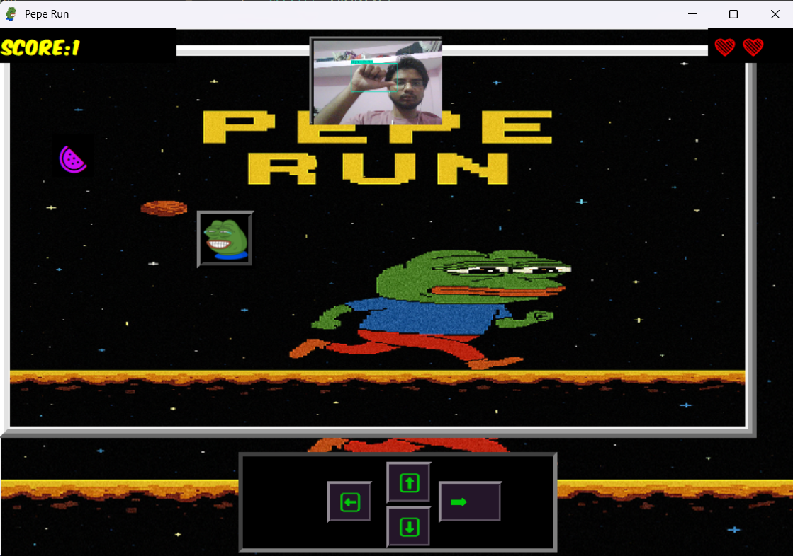

# 🧠🕹️ Pepe Run — Vision Controlled Arcade Game

**Pepe Run** is a retro-style 2D game where you control the player using **keyboard, buttons, or real-time hand gestures via your camera**.

It combines classic gameplay with **computer vision**, allowing you to move Pepe using gestures like **up, down, left, right** detected live from your webcam.

---

## 🚀 The Cool Part

- 🎮 Classic arcade gameplay (collect items, avoid misses)
- 📷 **Live camera feed inside the game UI**
- ✋ Gesture-based controls using a trained model
- ⚡ Smooth, low-latency input handling
- 🔄 Use **keyboard + buttons + camera together**

---

## 🧪 Tech Stack

- **Python**
- **Tkinter** (GUI)
- **OpenCV** (camera + image processing)
- **YOLO-based (self trained) Model** (gesture detection)
- **Pillow** (image handling for UI)
- **Pygame Mixer** (audio)

---

## 🎮 Preview



## ▶️ Try It Yourself

```bash
git clone https://github.com/ayaan0604/pepe-run
cd pepe-run
pip install -r requirements.txt
python game.py