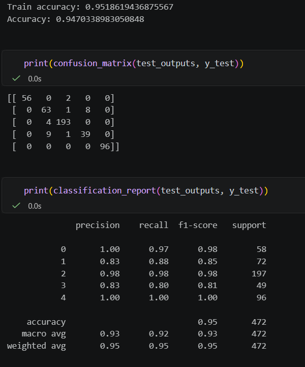

# Gesture Recognition Pipeline

This directory contains the complete machine learning workflow used for gesture recognition in **Pepe Run**.

It contains the entire development process, from collecting raw videos to deploying a trained classifier inside the game.

---

# Objective

The goal of this module is to classify a player's hand gesture in real time using only a webcam.

The predicted gesture is then used by the game as an input command.

Supported gestures are:

- Up
- Down
- Left
- Right
- None (neutral/no gesture)

---

# Project Evolution

The gesture recognition system has gone through multiple iterations.

## Previously

The original implementation used a YOLO-based object detector trained on manually annotated images.

Although functional, it suffered from several limitations:

- Sensitive to lighting conditions
- Sensitive to background changes
- Required large image datasets
- Computationally expensive

These limitations motivated a complete redesign.

---

## Current Approach

The current pipeline combines:

- OpenCV
- MediaPipe Hands
- PyTorch
- scikit-learn

Instead of classifying raw images, the model operates on MediaPipe's extracted 3D hand landmarks.

This approach dramatically reduces the input dimensionality while improving robustness across different users and environments.

---

# Directory Structure

```text
vision_model/

├── up/
├── down/
├── left/
├── right/
├── none/
│
├── dataExtraction.py
├── gesture_classification_dataset.csv
├── gesture.py
├── hand_landmarker.task
│
├── ver1/
├── ver2/
└── ver3/
```

---

# Dataset Collection

The dataset was created entirely from scratch.

For each gesture:

- Videos were recorded manually.
- Each gesture has its own folder.
- Videos are automatically processed by the data extraction pipeline.

```text
up/
down/
left/
right/
none/
```

---

# Data Extraction

The script `dataExtraction.py` automates dataset creation.

Its responsibilities include:

- Reading every recorded video.
- Extracting every third frame.
- Running MediaPipe Hands.
- Detecting hand landmarks.
- Normalizing landmark coordinates relative to the wrist.
- Extracting additional metadata such as:
    - handedness
    - confidence scores
    - landmark positions
- Writing the processed samples into a single CSV dataset.

This allows the entire dataset to be regenerated with a single script whenever additional training data is collected.

---

# Feature Representation

Each sample contains:

- 21 hand landmarks
- 3 coordinates per landmark (x, y, z)
- Wrist-normalized coordinates
- Handedness information
- Detection confidence
- Ground truth gesture label

The resulting dataset is stored as:

```
gesture_classification_dataset.csv
```

---

# Model Development

Model experimentation is organized into versioned folders.

Each version contains:

- Training notebook
- Saved model weights
- Configuration
- Label encoder
- Evaluation results

Example:

```text
ver2/

train.ipynb
state_dict.pth
config.json
LabelEncoder.pkl
evaluation/
```

This structure makes it possible to reproduce previous experiments and compare model improvements over time.



---

# Model Configuration

Each trained model includes a configuration file describing the network.

Example:

```json
{
    "num_features": 63,
    "num_classes": 5,
    "class_names": [
        "down",
        "left",
        "none",
        "right",
        "up"
    ]
}
```

Keeping configuration alongside model weights makes deployment reproducible and simplifies loading future models.

---

# Runtime Pipeline

During gameplay the prediction pipeline is:

```text
Camera
    ↓
OpenCV
    ↓
MediaPipe Hands
    ↓
Landmark Extraction
    ↓
Feature Normalization
    ↓
PyTorch Classifier
    ↓
Gesture Prediction
    ↓
Game Input
```

The prediction returned by `gesture.py` is used directly by the game to control the player character.

---

# Why MediaPipe Instead of YOLO?

The project originally used YOLO for gesture detection.

After experimentation, the pipeline was redesigned around MediaPipe because it offers several advantages.

| YOLO | MediaPipe + Classifier |
|------|------------------------|
| Learns from raw images | Learns from hand landmarks |
| Sensitive to backgrounds | Background independent |
| Larger model | Lightweight model |
| Higher computational cost | Real-time inference |
| Harder to generalize | Better cross-user performance |

The MediaPipe approach proved to be significantly more robust while remaining computationally efficient enough for real-time gameplay.

---

# Future Work

Potential improvements include:

- Larger and more diverse datasets
- Additional gestures
- Temporal sequence models (LSTM / Transformer)
- Confidence-based smoothing
- Personalized calibration
- Continuous gesture recognition
- Model quantization for faster inference

---

# Key Takeaway

This module represents the complete lifecycle of a machine learning system:

- Data collection
- Data preprocessing
- Feature engineering
- Model training
- Evaluation
- Versioning
- Deployment
- Integration into a real-time application

Rather than treating the trained model as a black box, every stage of the pipeline is included to make the project reproducible and easier to extend.